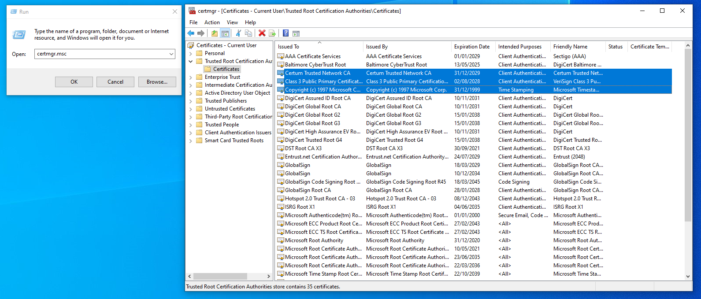

# Loader crash / bluescreen

## Loader crashing

1. Go to `C:\Windows\System32\drivers\etc`
2. Delete **hosts**

<figure><figcaption></figcaption></figure>

3. Open spoofer and try again

## Bluescreen

1. Press **Win + R**, type **certmgr.msc** and click **OK**
2.  Navigate to\
    \> **Trusted Root Certification Authorities**\
    **> Certificate**

    <figure><figcaption></figcaption></figure>
3. If you have a Certificate called **Cloudflare Inc**, right-click and delete it
4. If bluescreens still occur, disable GPU spoofing in the spoofers **Config** tab


If you still have the problem contact us on our [Discord](https://discord.com/invite/radiantaim).

