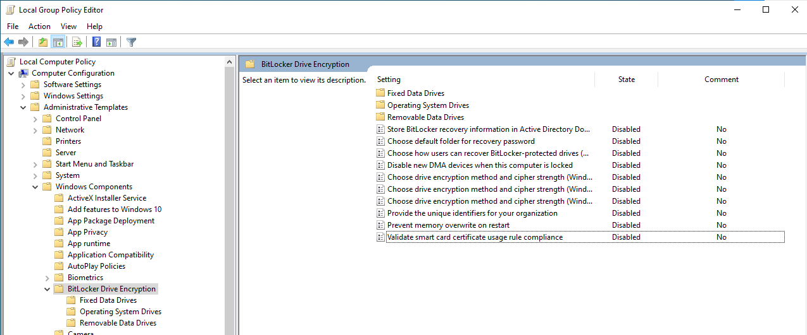
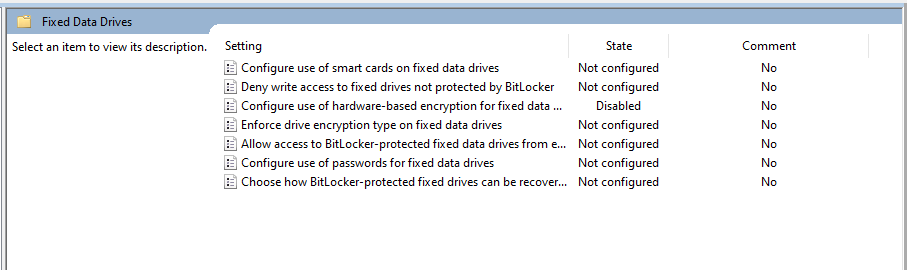
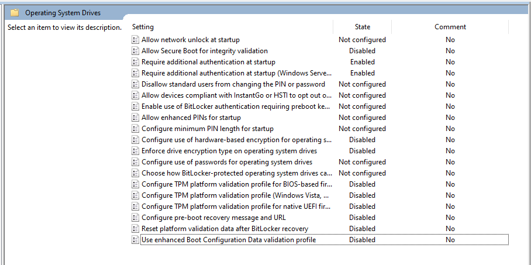
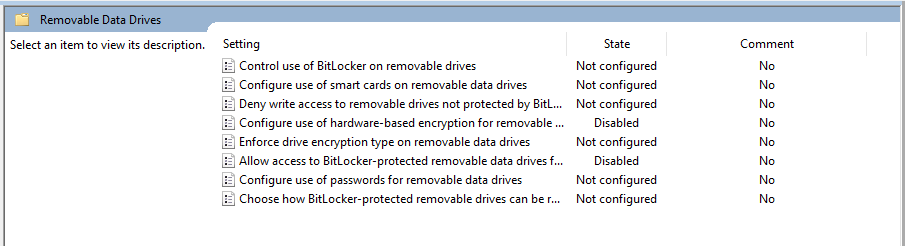

# TPM Pop-up bypass (AMD only!)

<figure><figcaption></figcaption></figure>

## Enable TPM

1. Enable TPM in your **BIOS Security Tab (Trusted Computing)**
2. If you have an AMD CPU, also **enable fTPM**

## Clear TPM

1. Search for **tpm.msc** and press Enter
2. Click **Clear TPM...**

<figure><figcaption>
Clear TPM
</figcaption></figure>

3. Confirm the restart and let your PC restart automatically


Do **NOT** restart manually or cancel the process


## Reinstall Secure Boot keys

1. Navigate to your **BIOS Boot**
2. Look for the Secure Boot **key management**
3. Delete / Clear the Secure Boot keys
4. Install default Secure Boot keys

## [Reinstall Windows](../windows-reinstall/clean-windows-reinstall.md)

## [BIOS Setup](../setup/bios-setup-other-mainboard.md)

## Disable SMT/Hyper-Threading

1. Navigate to your **BIOS Advanced CPU Configuration**
2. Disable **SMT/Hyper-Threading**
3. Download Hyper-V files [here](https://mega.nz/folder/2rA0wCRD#Wa0oz3UzCmMgF8CMbvbPGA)
4. Put the file on your desktop
5. Unzip the file


How to disable Hyper-V


6. In windows, search for **msinfo32** and press Enter. Check if the value for **Hyper-V - Virtualization Enabled in Firmware** is **No**

<figure><figcaption></figcaption></figure>

## [Download loader](https://github.com/marcvs-dev/Gitbook/blob/main/fixes/broken-reference/README.md)

## [Spoof HWID](https://github.com/marcvs-dev/Gitbook/blob/main/fixes/broken-reference/README.md)

## Configure gpedit.msc

1. Press **Win + R**, type **gpedit.msc** and click **OK**
2. Navigate to\
   \> **Computer Configuration**\
   **> Administrative Templates**\
   **> Windows Components**\
   **> BitLocker Drive Encryption**
3.  Configure the settings and the settings in the folder as shown\
    \
    **BitLocker Drive Encryption:**

    <figure><figcaption></figcaption></figure>

    \
    **Fixed Data Drives:**

    <figure><figcaption></figcaption></figure>

    \
    **Operating System Drives:**

    <figure><figcaption></figcaption></figure>

    \
    **Removable Data Drives:**

    <figure><figcaption></figcaption></figure>

## Use CloudFlare Warp

1. Download CloudFlare Warp from [here](https://1.1.1.1/)
2. Always leave it **Connected** in the background


