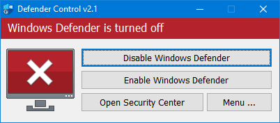

# Disable Windows Defender

## Disable Windows Defender manually

1. Select Start and type "Windows Security"
2. Select the Windows Security app from the search results, go to Virus & threat protection under Virus & threat protection settings select Manage settings
3. Switch Real-time protection to Off

## Disable Windows Defender with dControl

1. DownloaddControl [here](https://www.sordum.org/files/downloads.php?st-defender-control)
2. Unzip the file (Password: sordum)
3. Run dControl.exe
4. Disable Windows Defender

<figure><figcaption></figcaption></figure>
