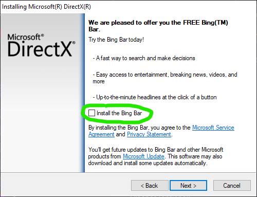

# Download loader

## Download Visual C++ Redistributable Runtimes All-in-One

1. Download vs redist [here](https://www.techpowerup.com/download/visual-c-redistributable-runtime-package-all-in-one/)
2. Unzip the file
3. Open "install\_all.bat" as **administrator**
4. Restart pc

## Download DirectX Runtimes

1. Download DirectX [here](https://www.microsoft.com/en-US/download/details.aspx?id=35)
2.  Uncheck **Install the Bing Bar**

    <figure><figcaption></figcaption></figure>
3. Open installer and install it

## Updating GPU drivers

1. For NVIDIA [select your graphics card here](https://www.nvidia.com/download/index.aspx) and install the driver for your Windows version
2. For AMD [select your graphics card here](https://www.amd.com/en/support) and install the driver for your Windows version

## Download loader

1. Download loader [here](https://mega.nz/file/waNXEYRa#fTHtZvDKlnD3AhbJv8yCU8rrJx8xaXwOEKknixlY2lY)
2. Put the file on your desktop
3. Unzip the folder
4. Run the loader once
