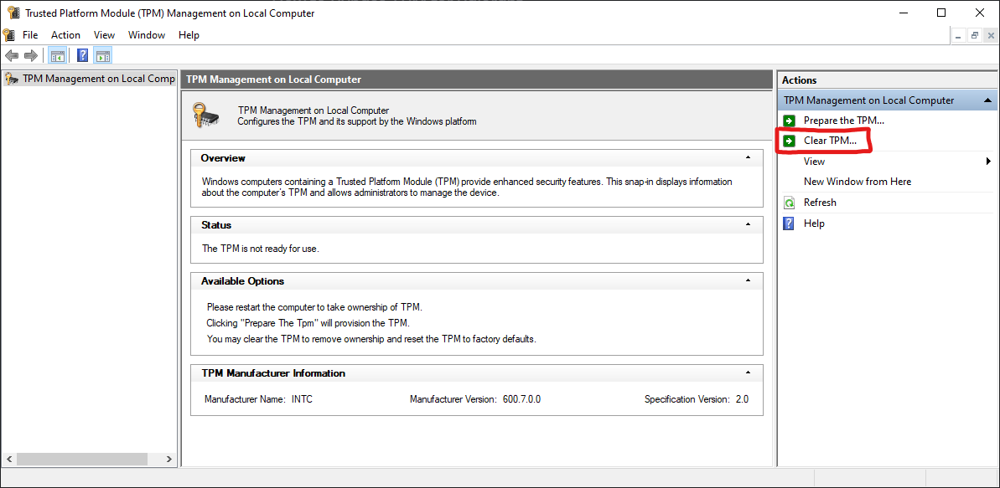

# VALORANT: Bypass TPM

## Enable TPM

1. Enable TPM in your **BIOS Security Tab (Trusted Computing)**&#x20;
2. If you have an AMD CPU, also enable **fTPM** or set it to **Firmware**

## Clear TPM

1. Press **Win + R**, type **tpm.msc** and click **OK**
2.  Choose **Clear TPM** and follow the steps. Your PC should end up restarting

    <figure><figcaption>
If your window looks different, TPM may still be disabled
</figcaption></figure>

## Use Bypass tool

1. Download the TPM Bypass tool [here](https://mega.nz/folder/iuZ3QaQa#wtBjvSJV-Pl23j-u5dwTaQ)
2. Run the tool
3. Enter your license key

## Confirm functionality

1. On every  PC boot, you should hear 2 beep sounds as a confirmation


If you ever see **Error Log.txt** on your Desktop or don't hear the 2 beep sounds, something went wrong.\
\
\
Contact Support

