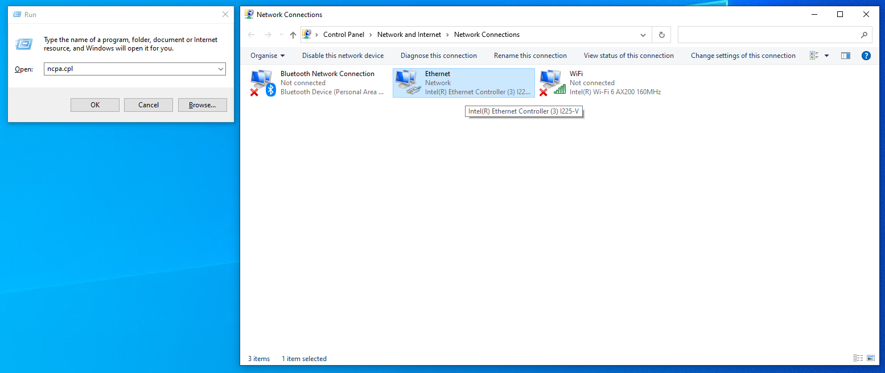

# Spoof MAC address

This step is only necessary and important when playing games that utilize the EAC (Easy Anti-Cheat) or BE (BattlEye) anti-cheat systems.

## E.g. list of EAC & BE games

| EAC     | BE                |
| ------- | ----------------- |
| Fornite | Rainbow Six Siege |
| Apex    | Ark               |
| Rust    | PUBG              |

## Download TMAC

1. Download TMAC [here](https://download.technitium.com/tmac/TMACv6.0.7\_Setup.zip)
2. Unzip the file
3. Run **TMAC\_setup.exe**

## Spoof MAC Addresses

1. Run **TMAC**
2. Select the network connection and click **Random MAC Address**
3. Repeat this for all of your networks

<figure><figcaption></figcaption></figure>

## Disable unused Network adapters

1.  Press **Win + R**, type **ncpa.cpl** and click **OK**

    <figure><figcaption></figcaption></figure>
2. Remember the name of the active connection
3. Right-click the Windows logo, select **Device Manager**
4. Right-click and select **Disable device** on all other Network adapters

<figure><figcaption></figcaption></figure>
