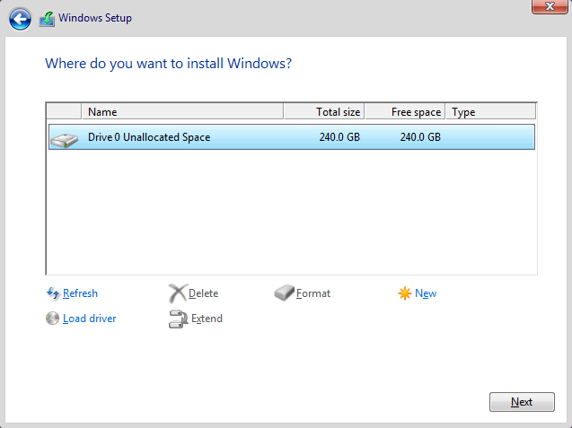

# Clean Windows reinstall

## Install ISO

1. Download Media Creation Tool [here](https://www.microsoft.com/en-us/software-download/windows10%20), click **Download Now**
2. Open **Media Creation Tool**
3. Select **Create installation media (USB flash drive, DVD or ISO file) for another PC**
4. Use the recommended options
5. Select **USB flash drive** _(min 8 GB)_
6. Select your USB flash drive _(this will remove all its data)_
7. Reboot your PC and enter BIOS
8. Select the USB flash drive as the first boot option and save
9. Select **Windows 10 Pro**

<figure><figcaption></figcaption></figure>

10. Select **I don't have a product key**

<figure><figcaption></figcaption></figure>

11. Select **Custom: Install Windows only (advanced)**

<figure><figcaption></figcaption></figure>

12. Delete **every** partition, so you have one entry saying Unallocated Space left for each drive

<figure><figcaption></figcaption></figure>

 

<figure><figcaption></figcaption></figure>


If you are unable to delete a partition, follow [this](https://youtu.be/Sz\_MxUYUpWA)[ guide](https://youtu.be/Sz\_MxUYUpWA)


13. Select your **main drive** and click **Next**
14. Continue with the setup and finish installing Windows


Do **NOT** login to Microsoft

Unplug USB devices when playing spoofed games

**Fortnite only:** Don't log in to Logitech G HUB or GeForce Experience

